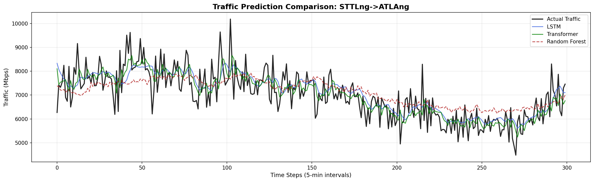
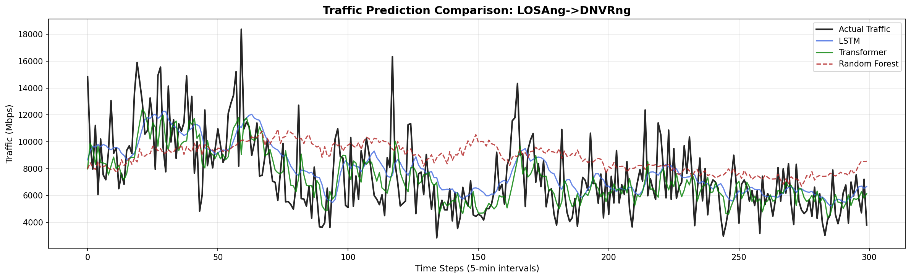
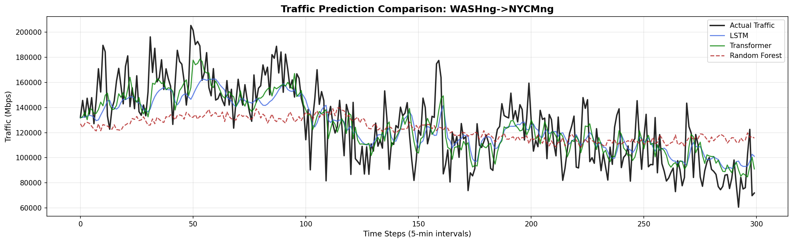
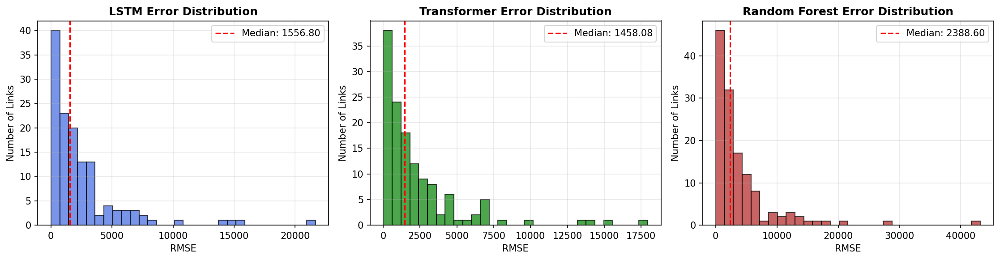
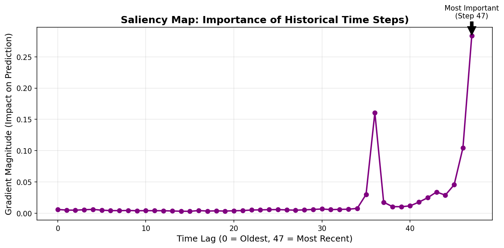

# Optical Network Traffic Prediction
### Comparative Analysis of Transformer, LSTM, and Random Forest Models on the Abilene Dataset


---

## Overview

This project develops and compares three machine learning models for **5-minute-ahead traffic volume prediction** across the 12-node Abilene Internet2 backbone network. Accurate traffic forecasting is essential for proactive resource allocation, congestion avoidance, and energy-efficient operation of optical networks.

The three models evaluated are:
- **Transformer** — encoder-only architecture with Multi-Head Self-Attention
- **LSTM** — two-layer stacked Long Short-Term Memory network
- **Random Forest** — ensemble of 100 decision trees (non-deep-learning baseline)

All models are compared against a **Persistence Baseline** (predicting t as t−1) to validate genuine predictive value.

---

## Results Summary

| Model | Overall RMSE (Mbps) | Overall MAE (Mbps) | vs. Baseline |
|---|---|---|---|
| **Transformer** | **3,782.03** | **1,746.16** | −10.31% ✅ |
| LSTM | 4,096.46 | 1,884.32 | −2.85% ✅ |
| Persistence Baseline | 4,216.62 | 1,959.35 | — |
| Random Forest | 6,924.70 | 3,081.30 | −64.22% ❌ |

The Transformer achieves the best performance, winning on **125 out of 132** network links.

---

## Key Visualisations

### Traffic Prediction — Best Performing Link (STTLng→ATLAng)


### Traffic Prediction — Median Link (LOSAng→DNVRng)


### Traffic Prediction — Worst Performing Link (WASHng→NYCMng)


### Per-Link Error Distributions Across All 132 Links


### Gradient-Based Saliency Map (Transformer Interpretability)


The saliency map shows the Transformer primarily relies on the most recent timesteps (steps 44–47), with a secondary peak near step 35 (~60 minutes prior), consistent with short-burst periodicity in backbone traffic.

---

## Dataset

**Abilene Network Traffic Matrix Dataset**
- 12-node Internet2 backbone network
- 48,096 timesteps at 5-minute resolution (March 2004 – September 2009)
- 132 origin-destination traffic links (after removing self-links)
- Publicly available via the Internet2 Abilene project

---

## Methodology

```
Raw XML Traffic Matrices (48,096 × 144)
        │
        ▼
  Drop Self-Links → (48,096 × 132)
        │
        ▼
  Add Cyclic Time Features (hour, day-of-week sin/cos) → (48,096 × 136)
        │
        ▼
  Log1p Transform (traffic columns only)
        │
        ▼
  MinMaxScaler [0,1] — fit on training set only
        │
        ▼
  PCA: 132 → 20 components — fit on training set only
        │
        ▼
  Final representation: (48,096 × 24) — 20 PCA + 4 time features
        │
        ▼
  Sliding Window (SEQ_LEN=48, stride=1) → (N, 48, 24)
        │
        ├──► Transformer (48×24 → 20 PCA outputs)
        ├──► LSTM        (48×24 → 20 PCA outputs)
        └──► Random Forest (1152 → 20 PCA outputs, flattened)
        │
        ▼
  Inverse Transform (PCA → Scaler → expm1) → Predictions in Mbps
```

---

## Model Architecture Details

### Transformer
| Parameter | Value |
|---|---|
| Model dimension (d_model) | 96 |
| Attention heads | 6 |
| Encoder layers | 3 |
| FFN inner dimension | 384 |
| Dropout | 0.25 |
| LR Schedule | Warmup Cosine (peak 5×10⁻⁵) |
| Total parameters | 339,860 |

### LSTM
| Parameter | Value |
|---|---|
| Layer 1 units | 128 (return_sequences=True) |
| Layer 2 units | 64 |
| Dropout | 0.2 |
| Loss | Huber |
| Optimiser | Adam (1×10⁻⁴) |
| Total parameters | 129,044 |

### Random Forest
| Parameter | Value |
|---|---|
| Estimators | 100 |
| Max depth | 20 |
| Input features | 1,152 (flattened 48×24) |
| Training time | 182 seconds |

---

## Repository Structure

```
optical-traffic-prediction/
│
├── optical_traffic_prediction.ipynb   # Main notebook (all cells)
├── README.md                          # This file
├── requirements.txt                   # Python dependencies
│
└── figures/
    ├── prediction_best_link.png       # STTLng→ATLAng predictions
    ├── prediction_median_link.png     # LOSAng→DNVRng predictions
    ├── prediction_worst_link.png      # WASHng→NYCMng predictions
    ├── error_distributions.png        # Per-link RMSE histograms
    └── saliency_map.png               # Transformer feature attribution
```

---

## How to Run

1. Open `optical_traffic_prediction.ipynb` in Google Colab
2. Mount your Google Drive and place the Abilene dataset archive at:
   `/content/drive/MyDrive/abilene-TM.tar.gz`
3. Run all cells sequentially (Runtime → Run All)
4. Results and figures are saved to `/content/abilene_experiments/`

> **Note:** A GPU runtime is recommended (Tesla T4 or equivalent).  
> Expected total runtime: ~25 minutes (LSTM ~12 min, Transformer ~8 min, RF ~3 min).

---

## Technical Stack

- **Python** 3.11
- **TensorFlow** 2.19.0 (Keras)
- **scikit-learn** 1.4
- **NumPy** 1.26
- **Pandas** 2.2
- **Matplotlib** 3.8
- **Google Colab** (NVIDIA Tesla T4 GPU)

---

## Academic Context

This project was developed as a Major Project (B.Tech, Electronics and Communications Engineering) at **Jaypee Institute of Information Technology (JIIT), Noida**.

**Supervisor:** Dr. Kaushik

---

## Key Findings

1. The **Transformer outperforms both LSTM and the persistence baseline** on overall RMSE, achieving a 10.31% improvement over the naive baseline.
2. **Random Forest underperforms** significantly on high-dimensional sequential data — the flattened 1,152-dimensional input loses temporal structure that sequential models exploit naturally.
3. **Gradient-based saliency analysis** reveals the Transformer relies primarily on the most recent 4–5 timesteps, with a secondary dependency ~60 minutes prior — consistent with known short-burst periodicity in backbone traffic.
4. **High-volume links** (e.g., WASHng→NYCMng, avg. 178,346 Mbps) produce large absolute RMSE values but remain tractable relative to traffic magnitude.

---

*Abilene dataset courtesy of the Internet2 Abilene Network project.*
